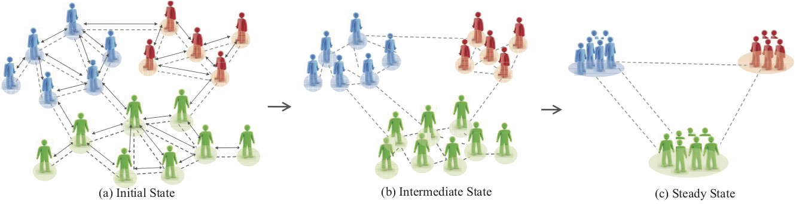

# Community detection based on distance dynamics


The `C` implementation of our KDD 2015 work: [Community Detection based on Distance Dynamics](https://dl.acm.org/citation.cfm?id=2783301).

## Data format
Format of the input network file (see Network_example.txt for example):
* Each line contains two integers: source node id and target node id of an undirected edge.
* The id of nodes begins at 1 and has to be continuous. For example, if the network has 34 nodes, the smallest node number is 1 and the biggest node number is 34

Format of the output result (see Result_example.txt for example): 
* Each line contains two number: the node id and its corresponding cluster id. 

## Run the model
1. (Optional) Change the the cohesion parameter in `attractor.c` (line 8);
2. (Optional) Change the the network's node number in `attractor.c` (line 17);
3. Compile the source code, e.g. 
```bash
# mac
gcc attractor.c -o attractor
# linux
gcc -std=c99 attractor.c -lm -o attractor
```
4. Run the code, e.g.
```bash
# the arguments are 1) input file, 2) output file and 3) edge number
./attractor Network_karate.txt Result_karate.txt 78
```

## Miscellaneous
- This source code supposes that the degree of the biggest degree node is smaller than 1000. If it is not this case, line 12 in `attractor.c` should be modified.


## Citation
```
@inproceedings{shao2015community,
  title={Community detection based on distance dynamics},
  author={Shao, Junming and Han, Zhichao and Yang, Qinli and Zhou, Tao},
  booktitle={Proceedings of the 21th ACM SIGKDD International Conference on Knowledge Discovery and Data Mining (KDD)},
  pages={1075--1084},
  year={2015}
}
```


## UPDATE
### 2016-11-30
- Correct _SortFun_ function which may cause mistake in finding CN and EN. For the experiments in paper, results of Zarachy, Football, Polbooks, Amazon, Friendship and synthetic networks are not changed. However, results of hepth (Collaboration) and RoadPa should be that HEPTH: correct modularity is 0.337 and new NCUT is 214.226 with 785 clusters (vs 0.579 and 1179 with 1384 clusters); ROADPA: correct modularity is 0.865 and new NCUT is 23136 with 56967 clusters (vs 0.856 and 25055 with 59919 clusters).